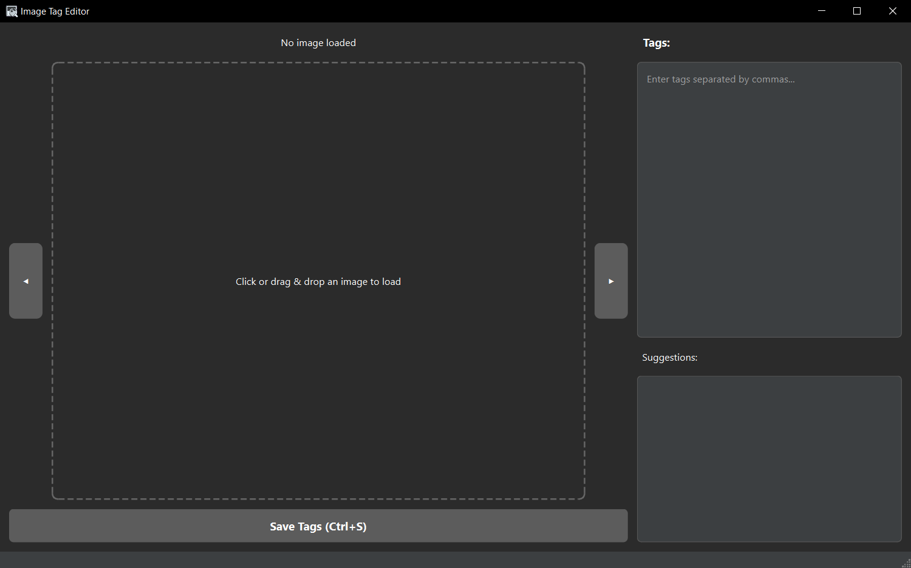

# Image Tag Editor - Простой редактор тегов для картинок

**Программа для добавления описаний к фотографиям и изображениям**



Представьте, что у вас много фотографий и картинок, и вы хотите их легко находить по описанию. Эта программа помогает добавлять к каждой картинке текстовые метки (теги) - например, "кот", "зелёные глаза", "сидит". Потом по этим меткам можно легко искать нужные изображения.

## 🎯 Для чего эта программа?

- **Организация фото коллекций** - быстро найти нужное фото среди тысяч
- **Подготовка данных для нейросетей** - описать картинки для обучения ИИ  
- **Каталогизация изображений** - создать удобную систему поиска
- **Работа с большими архивами** - не потеряться в море фотографий

## 🚀 Быстрый старт - всего 3 шага!

### Шаг 1: Скачайте программу
1. Перейдите на [страницу скачивания](https://github.com/Jawerka/image-tag-editor/releases)
2. Найдите последнюю версию (самую верхнюю)
3. Скачайте файл `ImageTagEditor.exe`
4. Сохраните его в любую удобную папку

### Шаг 2: Настройте как программу по умолчанию (НОВОЕ!)
**Теперь Image Tag Editor можно назначить программой по умолчанию для изображений!**

1. Запустите `register.bat` или выполните `python register_app.py`
2. Откройте `Параметры Windows` → `Приложения` → `Приложения по умолчанию`
3. Найдите `Image Tag Editor` и назначьте его для типов изображений
4. Готово! Теперь двойной клик по изображению открывает его в программе

📖 Подробная инструкция: [WINDOWS_DEFAULT_APP_SETUP.md](WINDOWS_DEFAULT_APP_SETUP.md)

### Шаг 3: Скачайте базу подсказок (необязательно, но очень удобно)
База подсказок поможет вам быстрее вводить теги - программа будет предлагать варианты автоматически.

1. Откройте [репозиторий с базой тегов](https://github.com/DominikDoom/a1111-sd-webui-tagcomplete)
2. Зайдите в папку `tags`
3. Найдите файл `derpibooru.csv`
4. Нажмите на него, затем кнопку "Raw"
5. Сохраните файл как `derpibooru.csv` в ту же папку, где лежит `ImageTagEditor.exe`

### Шаг 4: Запустите программу
1. Дважды кликните по `ImageTagEditor.exe`
2. Если Windows показывает предупреждение:
   - Нажмите "Подробнее"
   - Затем "Выполнить в любом случае"
3. Готово! Теперь перетащите любую картинку в окно программы

## 📸 Что умеет программа

✅ **Работает с популярными форматами**: PNG, JPG, JPEG, WEBP, GIF, BMP
✅ **Автодополнение тегов** - начните печатать и выберите из предложенных вариантов
✅ **Автосохранение** - теги сохраняются в текстовый файл рядом с картинкой
✅ **Быстрая навигация** - переключайтесь между картинками в папке
✅ **Тёмная тема** - приятная для глаз во время работы
✅ **Горячие клавиши** - ускоряют работу

## ⌨️ Основные клавиши (запомните главные)

| Клавиши | Что делает |
|---------|------------|
| `Ctrl+O` | Открыть картинку |
| `Ctrl+S` | Сохранить теги |
| `F1` / `F2` | Предыдущая / следующая картинка |
| `←` / `→` | Также переключение картинок |
| `↑` / `↓` | Выбор из подсказок |
| `Enter` или `Tab` | Принять подсказку |
| `Esc` | Убрать подсказки |

## 🔧 Что делать, если программа не запускается

### Проблема: "Не удается запустить приложение"
**Решение**: Установите Microsoft Visual C++ Redistributable
1. Откройте [страницу Microsoft](https://learn.microsoft.com/en-us/cpp/windows/latest-supported-vc-redist)
2. Скачайте файл `vc_redist.x64.exe` (для 64-битной Windows)
3. Установите его и перезагрузите компьютер

### Проблема: Windows блокирует запуск
**Решение**: Это нормально для новых программ
1. В окне предупреждения нажмите "Подробнее"
2. Затем "Выполнить в любом случае"
3. Или добавьте папку с программой в исключения антивируса

### Проблема: "База данных не найдена"
**Решение**: Проверьте файл с тегами
1. Убедитесь, что файл `derpibooru.csv` лежит рядом с `ImageTagEditor.exe`
2. Проверьте, что имя файла точно `derpibooru.csv` (не `derpibooru.csv.txt`)

## 💡 Полезные советы для новичков

### Как лучше составлять теги:
- **Разделяйте запятыми**: `кот, рыжий, сидит, дома`
- **Используйте простые слова**: лучше "собака" чем "четвероногий друг"
- **Добавляйте детали**: цвета, позы, эмоции, место съёмки
- **Будьте последовательны**: если решили писать "кот", всегда пишите "кот", а не "котик"

### Примеры хороших тегов:
```
девушка, длинные волосы, улыбка, парк, весна, солнечно
машина, красная, спортивная, дорога, скорость
торт, шоколадный, день рождения, свечи, праздник
```

### Как организовать работу:
1. **Сначала основное**: что или кто изображён
2. **Потом детали**: цвета, размеры, формы  
3. **Затем контекст**: где, когда, зачем
4. **И эмоции**: настроение, чувства

## 🛠️ Для разработчиков (продвинутый уровень)

<details>
<summary>Нажмите, чтобы увидеть инструкции для программистов</summary>

### Установка и настройка окружения разработки

#### Шаг 1: Установка Git

Git необходим для загрузки исходного кода проекта с GitHub.

1. **Скачайте Git**:
   - Перейдите на [официальный сайт Git](https://git-scm.com/downloads)
   - Скачайте версию для вашей операционной системы
   - Запустите установщик и следуйте инструкциям

2. **Настройка Git (необязательно, но рекомендуется)**:
   ```bash
   git config --global user.name "Ваше имя"
   git config --global user.email "ваш-email@example.com"
   ```

3. **Проверьте установку**:
   ```cmd
   git --version
   ```
   Должна отобразиться версия Git.

**Альтернативные способы получения кода:**
- Если не хотите устанавливать Git, можете скачать архив с кодом:
  - Откройте [страницу репозитория](https://github.com/Jawerka/image-tag-editor)
  - Нажмите зеленую кнопку "Code"
  - Выберите "Download ZIP"
  - Распакуйте архив в удобную папку

#### Шаг 2: Установка Python

1. **Скачайте Python 3.10 или новее**:
   - Перейдите на [официальный сайт Python](https://www.python.org/downloads/)
   - Скачайте последнюю версию для Windows
   - **ВАЖНО**: При установке обязательно поставьте галочку "Add Python to PATH"

2. **Проверьте установку**:
   ```cmd
   python --version
   pip --version
   ```
   Должны отобразиться версии Python и pip.

#### Шаг 3: Загрузка исходного кода

```bash
# Клонирование репозитория
git clone https://github.com/Jawerka/image-tag-editor.git
cd image-tag-editor
```

#### Шаг 4: Создание виртуального окружения

Виртуальное окружение изолирует зависимости проекта от системного Python.

**Для Windows (cmd):**
```cmd
# Создание виртуального окружения
python -m venv venv

# Активация окружения
venv\Scripts\activate

# Проверка активации (должен появиться (venv) в начале строки)
```

**Для Windows (PowerShell):**
```powershell
# Создание виртуального окружения
python -m venv venv

# Активация окружения
venv\Scripts\Activate.ps1

# Если возникает ошибка ExecutionPolicy, выполните:
Set-ExecutionPolicy -ExecutionPolicy RemoteSigned -Scope CurrentUser
```

**Для Linux/macOS:**
```bash
# Создание виртуального окружения
python3 -m venv venv

# Активация окружения
source venv/bin/activate
```

#### Шаг 5: Установка зависимостей

После активации виртуального окружения установите необходимые модули:

```bash
# Обновление pip до последней версии
python -m pip install --upgrade pip

# Установка зависимостей из requirements.txt
pip install -r requirements.txt

# Проверка установленных пакетов
pip list
```

**Основные зависимости проекта:**
- `PyQt6` - графический интерфейс
- `pandas` - обработка данных
- `numpy` - математические операции
- `pyinstaller` - сборка в exe файл

#### Шаг 6: Запуск приложения из окружения

```bash
# Убедитесь, что виртуальное окружение активно (видна приставка (venv))
# Запуск основного скрипта
python main.py
```

#### Шаг 7: Сборка исполняемого файла

```bash
# Установка PyInstaller (если не установлен)
pip install pyinstaller

# Сборка приложения в exe файл
pyinstaller ImageTagEditor.spec

# Готовый exe файл появится в папке dist/
dir dist
```

#### Деактивация виртуального окружения

После завершения работы деактивируйте окружение:

```bash
deactivate
```

#### Возможные проблемы и решения

**Проблема**: `python` не распознается как команда
**Решение**: Переустановите Python с галочкой "Add Python to PATH" или добавьте Python в PATH вручную.

**Проблема**: Ошибка при установке PyQt6
**Решение**: 
```bash
pip install --upgrade pip setuptools wheel
pip install PyQt6 --no-cache-dir
```

**Проблема**: Ошибка ExecutionPolicy в PowerShell
**Решение**:
```powershell
Set-ExecutionPolicy -ExecutionPolicy RemoteSigned -Scope CurrentUser
```

**Проблема**: Модуль не найден при запуске
**Решение**: Убедитесь, что виртуальное окружение активировано (видна приставка `(venv)`).

#### Структура проекта после установки

```
image-tag-editor/
├── venv/                    # Виртуальное окружение (создается автоматически)
│   ├── Scripts/            # Исполняемые файлы (Windows)
│   ├── Lib/               # Установленные пакеты
│   └── pyvenv.cfg         # Конфигурация окружения
├── main.py                 # Основной файл программы
├── requirements.txt        # Список зависимостей  
├── ImageTagEditor.spec     # Спецификация для PyInstaller
├── icon.ico               # Иконка программы
├── dist/                  # Папка с собранным exe (после сборки)
├── build/                 # Временные файлы сборки
└── README.md              # Документация
```

#### Полезные команды для разработки

```bash
# Обновление всех пакетов
pip list --outdated
pip install --upgrade package_name

# Создание нового requirements.txt
pip freeze > requirements.txt

# Очистка кэша pip
pip cache purge

# Запуск тестов (если есть)
python -m pytest test_functions.py

# Проверка кода на ошибки
python -m py_compile main.py
```

</details>

## 📁 Структура проекта

```
image-tag-editor/
├── main.py              # Основной файл программы
├── requirements.txt     # Список зависимостей  
├── README.md           # Этот файл с инструкциями
├── LICENSE             # Лицензия проекта
├── icon.ico            # Иконка программы
└── derpibooru.csv      # База тегов (скачивается отдельно)
```

## ❓ Частые вопросы

**В: Можно ли использовать свою базу тегов?**
О: Да, создайте CSV файл в том же формате, что и `derpibooru.csv`.

**В: Поддерживает ли программа русские теги?**
О: Да, можно писать теги на любом языке.

**В: Где сохраняются теги?**
О: В текстовом файле рядом с картинкой. Например, для `photo.jpg` создастся `photo.txt`.

## 📞 Помощь и поддержка

- **Сообщить об ошибке**: [Issues на GitHub](https://github.com/Jawerka/image-tag-editor/issues)
- **Скачать новую версию**: [Releases](https://github.com/Jawerka/image-tag-editor/releases)
- **Исходный код**: [GitHub репозиторий](https://github.com/Jawerka/image-tag-editor)

## 📄 Лицензия

Проект распространяется под лицензией MIT - можете свободно использовать и изменять код.

---

**Удачной работы с вашими изображениями! 🎨**
